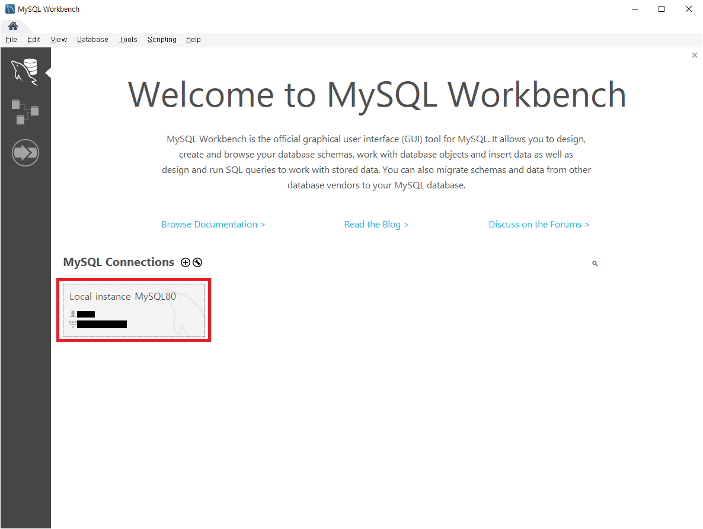
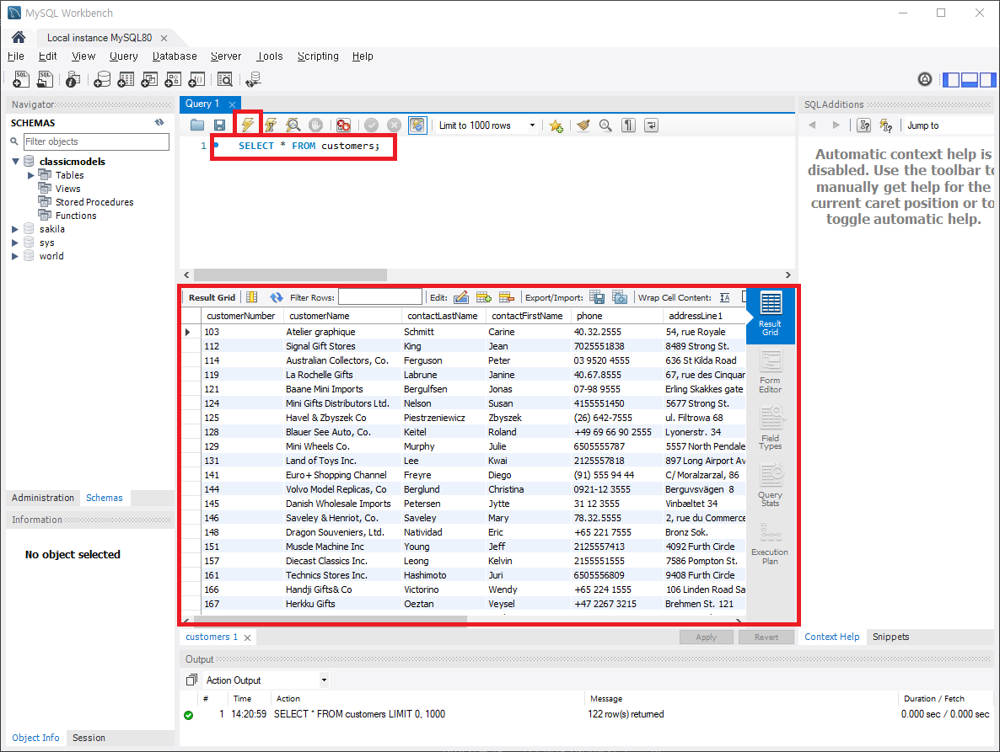

# MySQL Workbench

## MySQL 실행
1. Workbench를 실행

2. 원하는 MySQL을 누르고 비밀번호 입력

 

## 데이터베이스 추가
1. 좌측 Navigator에서 Data Import/Restore 클릭

2. 파일 선택 후 import

3. import가 끝났다면 좌측 Schemas 창 열기

4. 생성된 데이터베이스 확인

 

## 쿼리 실행

1. 에디터에 쿼리문 입력
2. 실행 후 출력 된 결과 확인
